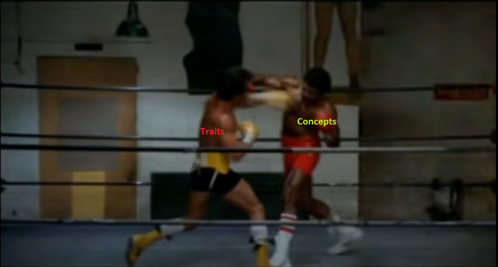

---
<!-- _class: lead invert-->


## twitter: [@rustcpp_cardiff](https://twitter.com/rustcpp_cardiff)
## email: [rustandcppcardiff@gmail.com](rustandcppcadiff@gmail.com)
## youtube: [Rust and Cpp Cardiff Meetup](https://www.youtube.com/channel/UCKre6QmGZ270Og0uLylTSVA/videos)
---

<!-- _class: lead invert-->

# Objectives

Learn and share
Introduce new people
Challenge ourselves
Real world solutions
Advance our ability

---


---
<!-- _class: invert-->

# Conduct

- Privacy
- [Code of Conduct](https://www.rust-lang.org/policies/code-of-conduct)
  - Just be wonderful
- [Pacman rule](https://www.ericholscher.com/blog/2017/aug/2/pacman-rule-conferences/)

---

<!-- _class: lead invert-->


---

<!-- _class: lead-->

# **Traits vs Concepts**




<!--

I'm Alex Payne, 
Software engineer for GIS products at Esri for the past 2 years
Background prior to that is in engineering software and computer games.

Today I'm going to be discussing Rust Traits and CPP Concepts,
with the aim of trying to figure out if they are comparable, and if they are, is one better than the other.

Until we get to that point, much like the end of Rocky 3 on screen, we'll never know which one is the winner.
-->
---

## Traits

<!--
For those of you that have gone through the Rust book as a part of our Rust Book Club series.
you may get a sense of deja vu as, all of the information about Traits comes from the rust book

But if you haven't seen the videos I highly recommend it. 
Richard and Ciara did a great job covering the chapters covering Traits.

So what is a trait? Well the rust book has the following definition:

We can think of them as almost analogous to interfaces from OO languages. 

When a Rust struct implements a trait, we're saying that the type has the ability to do some behaviour,
but we're leaving the implementation detail down to the struct itself.

That's usually the case, but Traits _can_ have default implementations. So in that respect, you can also 
consider Traits as a means of type-restricted code reuse. 
-->

A trait defines functionality a particular type has and can share with other types. We can use traits to define shared behaviour in an abstract way.

---

### Defining and Implementing Traits
<!--
This is the code example the rust book gives us.

We've defined a trait called Summary with a single method called Summarize. 
Then we've got this NewsArticle struct, and using the impl trait for syntax
we can extend NewsArticle so that the type system knows it shares the Summary trait
and it provides it's own implementation of the Summarize method.
-->

```rust
pub trait Summary {
    fn summarize(&self) -> String;
}

pub struct NewsArticle {
    pub headline: String,
    pub location: String,
    pub author: String,
    pub content: String,
}

impl Summary for NewsArticle {
    fn summarize(&self) -> String {
        format!("{}, by {} ({})", self.headline, self.author, self.location)
    }
}
```
--- 

### Trait Bounds
<!--
So you you might be thinking, "Oh cool, now I can make functions that 
accept anything that implements summary".
And you'd be right.

The book gives us this next description...
And goes on to describe Rust's syntax for specifying a function with
an argument that implements a specific trait.

Looks straightforward right? That's because it is. 

But here's my next question, what if I wanted to restrict the argument so that it implemented two or more traits?

In C++ (or another OO language) you might go, "well if my type has to implement two interfaces, 
then I'm going to have to create a type that implements both those interfaces, and use that."
With that line of thinking, you'll start building an inheritance hierarchy.
-->

We can use trait bounds to specify that a generic type can be any type that has certain behaviour.

```rust
pub fn notify(item: &impl Summary) {
    println!("Breaking news! {}", item.summarize());
}
```
---

### Supertraits

<!--
And you can do that with Rust. Chapter 19 of the Rust book covers "super traits". 
When writing a trait that depends on another, the depended on trait is called a super trait.
You would do this so that your trait definition can make use of the associated items of the second trait.

Here's a cut down version of the example from the book. We define a trait that depends on another, 
and implement a struct with uses it. But crucially we've only implemented the OutlinePrint trait,
and not the format_Display super trait. 

So this wil fail to compile.
-->

```rust
trait OutlinePrint: fmt::Display {
    fn outline_print(&self) {
        /* ... */
    }
}

struct Point {
    x: i32,
    y: i32,
}

impl OutlinePrint for Point {}
```
---

### Supertraits

<!-- And we can see example compiler output which tells us exactly why we've failed.-->

```
error[E0277]: `Point` doesn't implement `std::fmt::Display`
 src/main.rs:20:6
   |
20 | impl OutlinePrint for Point {}
   |      ^^^^^^^^^^^^ `Point` cannot be formatted with the default formatter
   |
   = help: the trait `std::fmt::Display` is not implemented for `Point`
   = note: in format strings you may be able to use `{:?}` (or {:#?} for pretty-print) instead
note: required by a bound in `OutlinePrint`
  --> src/main.rs:3:21
   |
3  | trait OutlinePrint: fmt::Display {
   |                     ^^^^^^^^^^^^ required by this bound in `OutlinePrint`
```

---
### Trait bound using multiple traits
<!--
But using supertraits introduces type coupling
and in many cases this approach is not desirable.

Thankfully Rust provides syntax for specifying 
that a single argument must implement multiple traits.
-->

```rust
pub fn notify(item: &(impl Summary + Display)) { /* something */ }
```

<!--And just to keep us sane when the number of traits gets too large, rust as an alternative syntax to express this using where clauses-->

```rust
fn some_function<T, U>(t: &T, u: &U) -> i32
    where T: Display + Clone,
          U: Clone + Debug
{
  /* something */
}
```
---
### Returning Traits

<!--

We can also specify that return types implement particular traits 
by adding the impl keyword before the return type of a method.
As shown in this example.

But what we can't do is decide at run time what the concrete type will be,
meaning the code example on the next slide is invalid 
-->

```rust
fn returns_summarizable() -> impl Summary {
    Tweet {
        username: String::from("horse_ebooks"),
        content: String::from(
            "of course, as you probably already know, people",
        ),
    }
}
```
---
### Returning Traits and Static Dispatch
<!--
Rust needs to be able to determine what the true concrete return type is at compile time.
This is a process of the compiler called monomorphization, and the code the compiler produces is
static dispatch code. The compiler has to figure out exactly which method is going to be called at compile time.

It can't do that if the type returned is dependant on the value of the boolean argument.
-->

```rust
fn returns_summarizable(switch: bool) -> impl Summary {
    if switch {
        NewsArticle {
            headline: String::from(
                "Penguins win the Stanley Cup Championship!",
            ),
            location: String::from("Pittsburgh, PA, USA"),
            author: String::from("Iceburgh"),
            content: String::from("The Pittsburgh Penguins once again are the best hockey team in the NHL.",
            ),
        }
    } else {
        Tweet {
            username: String::from("horse_ebooks"),
            content: String::from(
                "of course, as you probably already know, people",
            ),
        }
    }
}
```

---

### Trait Objects

<!--
To get around this problem, we would need to return a Trait Object.

By wrapping the returned Trait in a Box, we ensure that the struct is created on the heap at runtime. 
This allows the compiler to produce dynamic dispatch code instead, 
meaning we can decide what our true returned type will be at runtime.
-->

```rust
fn returns_summarizable(switch: bool) -> Box<dyn Summary> {
    if switch {
        Box::new(NewsArticle {
            headline: String::from(
                "Penguins win the Stanley Cup Championship!",
            ),
            location: String::from("Pittsburgh, PA, USA"),
            author: String::from("Iceburgh"),
            content: String::from("The Pittsburgh Penguins once again are the best hockey team in the NHL.",
            ),
        })
    } else {
        Box::new(Tweet {
            content: String::from(
                "of course, as you probably already know, people",
            ),
        })
    }
}
```
---
#### Traits: Conditional method implementation with trait bounds

<!-- 
One last note about trait bounds.

We can use trait bounds to conditionally 
implement structs that use generic type parameters.
We've got another example from the book on screen.

We've created a struct called Pair, which always has two instances of some type T.
But when implementing methods for the struct, by adding these trait bounds
for Display and PartialOrd, we've specified that we only implement the 
cmp_display method if type T implements both of these traits.
-->

```rust
struct Pair<T> {
    x: T,
    y: T,
}

impl<T> Pair<T> {
    fn new(x: T, y: T) -> Self {
        Self { x, y }
    }
}

impl<T: Display + PartialOrd> Pair<T> {
    fn cmp_display(&self) {
        /* Do Something*/
    }
}
```

---

### Traits: Summary

- Traits define abstract behavior that can be utilized by multiple types
- We can define function argument types with a trait
- We can use traits to constrain function arguments
- We can constrain return types using traits
- We can conditionally create types on the heap at runtime using trait objects.
- We can use traits to conditionally implement methods

---

## Concepts

<!-- 
Introduced in C++20, a Concept is a constraint for template parameters which are evaluated at compile time.

For anyone unfamiliar, templates are C++'s mechanism for creating generic functions/classes.
At compile time the compiler looks at the calls made to those functions/classes,
and replaces the template paramater T with the type provided in the call, and then tries to compile it.

So that type T could, theoretically, be anything. Unless we constrain it.

As an example, this second snippet defines a concept called integral. 
We can see familiarities with other c++ template<> constructs. 
We use the new concept keyword to declare a concept and provide a name for it. 
`std::is_integral_v` comes from the <type_traits> header (not to be confused with rust traits). 
It yields true/false depending on if the type T is an integral type. (e.g. int, long, char etc).
-->

Concept: a constraint for template parameters which are evaluated at compile time

```cpp
template <class T>
T GetMax (T a, T b) {
 return (a > b ? a : b);
}
```

```cpp
#include <type_traits>

template <class T>
concept integral = std::is_integral_v<T>;
```
---
### Defining Concepts

<!-- We can build our own, more complex concepts as well, 
using the requires keyword to create what's known as a requires expression.

Drawing from the traits example from the Rust book, 
I've defined a concept called summerizable that requires an object of type T 
that has a member function called get_name(), which returns something convertible to std::string.
-->

```cpp
template <typename T>
concept summerizable = requires(T v) {
    {v.get_name()} -> std::convertible_to<std::string>;
};
```

---
### Using Concepts

<!--
To make use of a concept, we utilise the new requires keyword 
to specify that a templated class or function is required to satisfy one or more constraints.

We've got nice syntactic options for the requires keyword, 
we can place it above the function declaration 
or we can specify the requirements right at the end, before the source code.
-->

```cpp
template <typename T>
requires CONDITION
void DoSomething(T param) { }

template <typename T>
void DoSomething(T param) requires CONDITION { }
```

---
<!-- 
So lets put it all together, we've got this small code snippet that has
a templated function that is constrained with the summerizable concept I defined previously,
and a class called Book which conforms to the constraint. 

Btw if you're wondering where the book title came from, 
I googled 'Funny Book Names' and that was the first one. 
I think it must've been fate for the Cardiff RustCPP group.
-->

```cpp
template <typename T>
concept summerizable = requires(T v) {
    {v.get_name()} -> std::convertible_to<std::string>;
};

template<typename T>
requires summerizable<T>
void summerize(T v) {
    /* Do something */
}

class Book {
public:
    Book(const std::string& name) : m_name(name) { }
    std::string get_name() const { return m_name; }

private:
    std::string m_name;
};

int main() {
    Book book("Teach Your Cat Welsh - Anne Cakebread");
    summerize(book);
}
```

---

### Error Messages 

<!--
That's all well and good, but what about when something doesn't meet the constraints?
Well the compiler will let us know if the type doesn't fulfil the concept. Here's the compiler output if I comment out the get_name method.

It points me to the offending line 30, which is the call to is_summerizable. 
It tells me the constraints aren't satisfied and points me to the templated & constrained method being used. 
It's much more useful than some of the cryptic error messages C++ normally spits out for templated functions. 

In fairness, we get much different output depending on the compiler. 
This is msvc. With gcc we get the following...
-->

```cpp
class Book {
public:
    Book(const std::string& name) : m_name(name) { }
    //std::string get_name() const { return m_name; }

private:
    std::string m_name;
};
```
```
<source>(30): error C2672: 'is_summerizable': no matching overloaded function found
<source>(11): note: could be 'void is_summerizable(T)'
<source>(30): note: 'is_summerizable': the associated constraints are not satisfied
<source>(11): note: see declaration of 'is_summerizable'
```
---

### Error Messages

<!--

This is much better, not only do we get the offending line and the 
constrained method that is being used, but we also get an 
explanation of why the concept that hasn’t been satisfied.
-->

```
<source>: In function 'int main()':
<source>:30:20: error: no matching function for call to 'is_summerizable(Book&)'
   30 |     is_summerizable(book);
      |     ~~~~~~~~~~~~~~~^~~~~~
<source>:11:6: note: candidate: 'template<class T>  requires  summerizable<T> void is_summerizable(T)'
   11 | void is_summerizable(T v) {
      |      ^~~~~~~~~~~~~~~
<source>:11:6: note:   template argument deduction/substitution failed:
<source>:11:6: note: constraints not satisfied
<source>: In substitution of 'template<class T>  requires  summerizable<T> void is_summerizable(T) [with T = Book]':
<source>:30:20:   required from here
<source>:5:9:   required for the satisfaction of 'summerizable<T>' [with T = Book]
<source>:5:24:   in requirements with 'T v' [with T = Book]
<source>:6:16: note: the required expression 'v.get_name()' is invalid
    6 |     {v.get_name()} -> std::convertible_to<std::string>;

```
---
### Concepts and Introspection

<!--
When we think about it, the requires expression is pretty powerful.
If you consider this example, I like to think of what we're doing here as specifying an annonymous "interface" for clocks. 

Any templated type that fulfils the Clock concept must provide methods called start, stop and time. 
But because its a template argument, there is no restriction on the actual type used. 
We've gained the ability to perform some introspection of the type without relying on the type symbol.

Going back to the point I made in the rust examples earlier, 
this also means with Concepts, we've gained a way to ensure a single type 
complies with multiple concepts/interfaces/behaviours without having to couple them.
-->

```cpp
template <typename T>
concept Clock = requires(T c) { 
    c.start();  
    c.stop();
    c.getTime();
  };
```

---
### SFINAE
<!--
It's worth noting that while this looks nice and is genuinely useful, It isn't actually new. 
Introspection of template types to control compilation was already possible 
To see how, we need to dig a bit into SFINAE and overload resolution.

"Substitution Failure Is Not An Error" is a rule applies during overload resolution of function templates.
- When you call a templated method, the compiler has a list of potential methods that you could be trying to call
- When substituting the template with the type used in the calling code
  - If compilation of that method fails then the compiler doesn't immediately give up
  - It will try the next method available.
-->

Substitution Failure Is Not An Error

- A rule applied during overload resolution of function templates
- When substituting the specific type for a parameter fails...
  - The specialization is discarded from consideration instead of immediately erroring.

---
### SFINAE
<!--

We can take advantage of this rule, 
if we specify that templated type contains a specific non-class type.

Here compiling the second call to f will result in a 
deduction failure during overload resolution 
because int doesn't contain a member called foo. 

The SFINAE overload resolution rule allows us to keep 
examining other methods that may match.
If we were to remove the second definition of f, then the call to f<int> would not compile. 
-->

```cpp
struct Test {
  typedef int foo;
};

template <typename T>
void f(typename T::foo) {}  // Definition #1

template <typename T>
void f(T) {}  // Definition #2

int main() {
  f<Test>(10);  // Call #1.
  f<int>(10);   // Call #2. Without error (even though there is no int::foo)
                // thanks to SFINAE.
}
```
---
### SFINAE
<!--Not quite as helpful as our compiler output from the concepts example.-->
```
<source>: In function 'int main()':
<source>:10:9: error: no matching function for call to 'f<int>(int)'
   10 |   f<int>(10);   // Call #2. Fails
      |   ~~~~~~^~~~
<source>:6:6: note: candidate: 'template<class T> void f(typename T::foo)'
    6 | void f(typename T::foo) {}  // Definition #1
      |      ^
<source>:6:6: note:   template argument deduction/substitution failed:
<source>: In substitution of 'template<class T> void f(typename T::foo) [with T = int]':
```
---

### Concepts: Summary

- Concepts define reusable constraints for templated types
- Types can be made to comply with multiple concepts without them having to be coupled together
- Simplifies the existing practise (abuse?) of SFINAE to constrain templated types
- Not yet fully supported - C++20 is still not fully implemented by all major compilers
- Significant variation in compiler output

---

## Traits v Concepts: Similarities

<!--
It's worth noting that both Traits and Concepts are much deeper topics than I've presented here today.
But as far as we're concerned, I think the level of detail we've covered today is enough
to make some meaningful comparisons of the two mechanisms.

At the start of this talk I mentioned that we'd only be able to decide if
one is better than the other if they are actually comparable.

In some ways they are..

-->

- Both mechanisms are used to constrain types used by methods and classes/structs
- Both mechanisms avoid the need for type coupling
- Both provide mechanisms for type introspection
- Both have (relatively) nice syntax
- Both provide helpful compiler output

---

## Traits v Concepts: Differences

Traits are firmly a part of Rust's type system, but Concepts are not.

- Traits are mechanism to extend types and constrain arguments
- Concepts only constrain templated arguments

- Traits are fully integrated into the Rust Language
- Concepts are in the C++ standard but compilers haven't fully caught up yet

---
<!-- _class: lead-->
# **Traits vs Concepts**

<!--
So, is there a winner? Can there be a winner?

I think the key component comes down to what they're trying to do. 
Traits are trying to do so much more than Concepts:

They're a means of constraining input args and they're an inheritance mechanism.
They objectively serve a larger role in the language than concepts do in C++.

But the areas in which they share purpose, I don't think the answer is as clear cut if one is better than the other.

In syntax, Rust wins hands down I think. But mainly because C++ is hamstrung with it's long standing template syntax.
They both seem to do a good job in constraining the arguments,
providing type introspection and all without introducing unnecessary coupling.

The argument you might sometimes see online that C++ is just copying Rust doesn't hold true either I think.
(At least not when Traits v Concepts is concerned).

As we saw, while it was a bit hacky, it has always been possible to implement a form of constraint checking 
in C++ by leveraging the SFINAE overload resolution rule. 

In short, like the Rocky Balboa and Apollo Creed, I don't think we can decisively say which one is better.

I guarantee lots of people in the comments section right now can ;)

-->


---
### Further Reading

**Traits**
[Rust Book](https://doc.rust-lang.org/book/) Chapters 10.2, 17.2 and 19.2

**Concepts**
[CPPstories - Intro to Concepts](https://www.cppstories.com/2021/concepts-intro/)
[CPPreference - Constraints](https://en.cppreference.com/w/cpp/language/constraints)
[Wikipedia - SFINAE](https://en.wikipedia.org/wiki/Substitution_failure_is_not_an_error)
[CPPreference - SFINAE](https://en.cppreference.com/w/cpp/language/sfinae)
[CPPCON - Concepts](https://www.youtube.com/user/CppCon/search?query=concepts)
