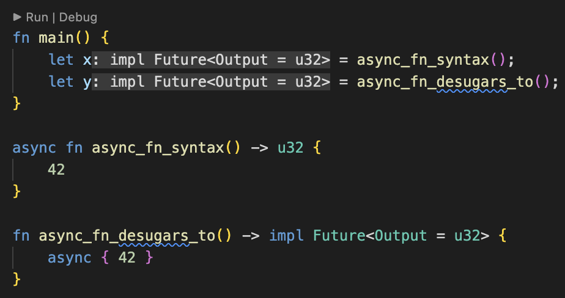

---
<!-- _class: lead invert-->


## twitter: [@rustcpp_cardiff](https://twitter.com/rustcpp_cardiff)
## email: [rustandcppcardiff@gmail.com](rustandcppcadiff@gmail.com)

---

<!-- _class: lead invert-->

# Objectives

Learn and share
Introduce new people
Challenge ourselves
Real world solutions
Advance our ability

---


---
<!-- _class: invert-->

# Conduct

- Privacy
- [Code of Conduct](https://www.rust-lang.org/policies/code-of-conduct)
  - Just be wonderful
- [Pacman rule](https://www.ericholscher.com/blog/2017/aug/2/pacman-rule-conferences/)

---

<!-- _class: lead invert-->


---


---

<!-- _class: lead-->

# Introduction to Async in Rust

---

# Introduction to Async in Rust

- Async vs parallelism
- Async rust primitives
  - What is a `Future`
  - What is an `async fn`
  - What does `await` do
- Tokio
- Async-std
- Futures & smol
- Scoped threads?

---

<!-- _class: invert-->

# What is Async Programming

- A concurrent programming model
- Syntax allows sequential looking code, but returning tasks/futures to continue the work instead of completing it before continuing

---

<!-- _class: invert-->

# Async vs pure parallelism

- For task which have to 'wait' on something, use async
  - e.g. listening to a port with a TcpListener
- For compute heavy tasks you want to parallelize, with no waiting, use a data parallelism library
  - e.g. rayon

---
<!-- _class: lead-->

> Threads are for working in parallel and async is for waiting in parallel.

_quote from the internet_

---

# Cooking Breakfast

- Concurrent tasks:
  - Fry Eggs 
  - Cook hash browns
  - Toast bread
    - -> then butter toast
  - Brew tea
    - -> then add milk to tea

---

# What does Rust provide?

- Minimal core primitives:
  1.  `Future` trait in standard library
  2. `async` keyword
  3.  `.await` syntax
- These can be used with third party library executors

---

# 1. `Future` trait

```rust
pub trait Future {
    /// The type of value produced on completion.
    type Output;

    /// Attempt to resolve the future to a final value, registering
    /// the current task for wakeup if the value is not yet available.
    ///
    /// This function returns:
    ///
    /// - [`Poll::Pending`] if the future is not ready yet
    /// - [`Poll::Ready(val)`] with the result `val` of this future if it
    ///   finished successfully.
    fn poll(self: Pin<&mut Self>, cx: &mut Context<'_>) -> Poll<Self::Output>;

```

---

# 2. What is an `async fn`

- `async` is a keyword use to annotate functions

```rust
async fn async_fn() -> u32 { 
    42
}
```
- Which is syntactic sugar for:
```rust
fn async_fn() -> impl Future<Output = u32> {
    async { 42 }
}
```
---

<!-- _class: lead -->



---

# 3. `.await` syntax

Await **yields back to the executor** to make progress

The executor (3rd party) might run the task to completion, or it might do a bit of the task, a bit of another, come back to it

Syntax allows you to describe the 'cooperative scheduling' of tasks

---

# Features of Async in Rust

- **Futures are inert** in Rust and make progress only when polled. Dropping a future stops it from making further progress.
- **Async is zero-cost** in Rust. You can use async without heap allocations and dynamic dispatch.
- **No built-in runtime** is provided by Rust. Instead, runtimes are provided by community maintained crates.
- **Both single- and multithreaded runtimes are available** in Rust, which have different strengths and weaknesses.

---

# When does the task run?

Some executor at a top level polls futures until progress can be made

A very basic executor might poll futures in a loop until they complete

---
<!-- _class: invert-->

## Async Runtime - Tokio

- Tokio (the most async common runtime) provides:
  - top level 'loop'
  - low level resources like network sockets and timers (e.g. `tokio::net::TcpListener`, `tokio::fs`, `tokio::timer`)

---
<!-- _class: invert-->

## Async Runtime - Tokio

- **Executor** holds on to state about what resources it's waiting on
- **Reactor** interacts with OS (via crate `Mio`) to say 'Wake me up if any of these file descriptors change state' (epoll, IO Completion Ports, kqueue)
- Also handles waiting on non-OS events e.g. receiving on a channel

---
<!-- _class: invert-->

## Scheduling tasks with Tokio

1. `#[tokio::main]` - annotate main function to 'make it async'
2.  `block_on` - run future to completion (often only one in main)
3.  `.await` - yield back to executor who will try to make progress on task. Don't do the code after until this is done
4.  `tokio::spawn` - create a new asynchronous task to be executed. Communicates 'this can run in parallel'
5. `tokio::spawn_blocking` - use instead of spawn for tasks which essentially block (i.e. not waiting, just a block of execution)
6. `join!(task1, task2, ...)` - do these tasks in any order, and don't run the code after until they're all complete

---
<!-- _class: invert-->

### 1. `#[tokio::main]` async fn main

```rust
#[tokio::main]
async fn main() {                                               
  call_some_async_fn().await; 
}
```

---
<!-- _class: invert-->

### 2. `block_on` with Tokio Main

```rust
fn main() -> Result<()> {
    let body = async { /* some async code */ };

    {
        return tokio::runtime::Builder::new_multi_thread()                                      
            .enable_all()
            .build()
            .expect("Failed building the Runtime")
            .block_on(body);
    }
}
```

---
<!-- _class: invert-->

### 2. `await` to wait on a port with Tokio

```rust
#[tokio::main]
async fn main() {
    // Bind the listener to the address
    let listener = TcpListener::bind("127.0.0.1:6379").await.unwrap();

    loop {
        // The second item contains the IP and port of the new connection.
        let (socket, _) = listener.accept().await.unwrap();
        process(socket).await;
    }
}
```
With this code, we can only process one socket at a time


---
<!-- _class: invert-->

### 3. `tokio::spawn` to schedule task

- Use for tasks which can be run in parallel
- Schedules a task on an asynchronous green thread
- Executor will decide whether or not the _will_ actually run in parallel
- Returns a join handle we can await if we need to get result
- Usual multithreading rules apply (e.g. channels, or `Arc<Mutex<T>>` to share data - see fearless concurrency)

---
<!-- _class: invert-->

#### 3. `tokio::spawn` to schedule task

```rust
#[tokio::main]
async fn main() {
    // Bind the listener to the address
    let listener = TcpListener::bind("127.0.0.1:6379").await.unwrap();                  

    loop {
        // The second item contains the ip and port of the new connection.        
        let (socket, _) = listener.accept().await.unwrap();

        // A new task is spawned for each inbound socket. The socket is
        // moved to the new task and processed there.
        tokio::spawn(async move {
            process(socket).await;
        });
    }
}
```

---
<!-- _class: invert-->

#### 4. `tokio::spawn_blocking`

Compute heavy operations which do not yield could prevent other futures from making progress.

This function runs the provided closure on a thread dedicated to blocking operations.

```rust
use tokio::task;

let res = task::spawn_blocking(move || {
    // do some compute-heavy work or call synchronous code
    "done computing"
}).await?;

assert_eq!(res, "done computing");
```

---
<!-- _class: invert-->

#### 5. `join!(task1, task2, ...)`

Waits on multiple concurrent branches, returning when all branches complete:

```rust
#[tokio::main]
async fn main() {
    let (first, second) = tokio::join!(
        do_stuff_async(),
        more_async_work());
    // do something with the values
}
```
If returning Results, `try_join!` can be used to return early when `Err` is encountered.

---

## Async Runtime - Async-std

Modelled to the Rust main standard library, replacing components with async counterparts, providing:
- an executor
- low level resources like filesystem operations, network operations, timers etc.

---

## Scheduling tasks with Async-std

1. `#[async_std::main]` - annotate main function to 'make it async'
2.  `block_on` - run future to completion (often only one in main)
3.  `.await` - yield back to executor who will try to make progress on task. Don't do the code after until this is done
4.  `async_stc::task::spawn` - create a new asynchronous task to be executed. Communicates 'this can run in parallel'
5. `async_std::task::spawn_blocking` - use instead of spawn for tasks which essentially block (i.e. not waiting, just a block of execution)
6. `futures::future::join` - do these tasks in any order, and don't run the code after until they're all complete

---

### 1. `#[async_std::main]` async fn main

```rust
use async_std;

#[async_std::main]
async fn main() {
    example().await;
}

async fn example() {
    /* do some async things */
}
```

---

### 2. `block_on` with async_std main

```rust
use async_std;
fn main() {
    async fn main() {
        {
            example().await;
        }
    }
    async_std::task::block_on(async { main().await })
}
async fn example() {}
```

---

### 3. `async_std::task::spawn` to schedule task

- Use for tasks which can be run in parallel
- Schedules a task on an asynchronous green thread
- Executor will decide whether or not the _will_ actually run in parallel
- Returns a join handle we can await if we need to get result
- Usual multithreading rules apply (e.g. channels, or `Arc<Mutex<T>>` to share data - see fearless concurrency)

---

#### 3. `async_std::task::spawn` to schedule task

```rust
#[async_std::main]
async fn main() {
    // Bind the listener to the address
    let listener = TcpListener::bind("127.0.0.1:6379").await.unwrap();

    loop {
        // The second item contains the ip and port of the new connection.
        let (socket, _) = listener.accept().await.unwrap();

        // A new task is spawned for each inbound socket.  The socket is
        // moved to the new task and processed there.
        async_std::task::spawn(async move {
            process(socket).await;
        });
    }
}
```

---

#### 4. `async_std::task::spawn_blocking`

Compute heavy operations which do not yield could prevent other futures from making progress.

This function runs the provided closure on a thread dedicated to blocking operations.

```rust
use async_std::task;

let res = task::spawn_blocking(move || {
    // do some compute-heavy work or call synchronous code
    "done computing"
}).await?;

assert_eq!(res, "done computing");
```

---

#### 5. `join!(task1, task2, ...)`

Waits on multiple concurrent branches, returning when all branches complete:

```rust
#[async_std::main]
async fn main() {
    let (first, second) = futures::join!(
        do_stuff_async(),
        more_async_work());
    // do something with the values
}
```
If returning Results, `try_join!` can be used to return early when `Err` is encountered.

---

<!-- _class: invert-->

# Async runtimes - Futures

- Predates async/await syntax
- Provides:
  - Future trait, and FutureExt trait (extension to Future providing convenient adapters)
  - mpsc channel
  - **Executor**
  - **block_on**
  - Other useful helpers & trait
---
<!-- _class: invert-->
## Async runtimes - Futures executor

```rust
use futures::executor; // 0.3.1

fn main() {
    let v = executor::block_on(some_async_fn());
    println!("{}", v);
}

async fn some_async_fn() -> u32 {
    42
}
```

---
# Async runtimes - smol

```rust
use smol::{io, net, prelude::*, Unblock};

fn main() -> io::Result<()> {
    smol::block_on(async {
        let mut stream = net::TcpStream::connect("example.com:80").await?;
        let req = b"GET / HTTP/1.1\r\nHost: example.com\r\nConnection: close\r\n\r\n";
        stream.write_all(req).await?;

        let mut stdout = Unblock::new(std::io::stdout());
        io::copy(stream, &mut stdout).await?;
        Ok(())
    })
}
```

---
<!-- _class: invert-->

# Common Abstractions

- Spawning a new task
- Starting a timer
- Plugging a task into another
- Async read and write traits?
- Make it so you can have e.g. file i/o without knowing what runtime is underneath

---

<!-- _class: invert-->

# Compatibility of runtimes

- Generally can't be mixed and matched
  - Tokio’s types cannot be used outside tokio context, so any attempt to use them will panic.
  - Tokio and futures have similar but different I/O traits AsyncRead, AsyncWrite, AsyncBufRead, and AsyncSeek.
- Crate `async_compat` can provide adapters https://docs.rs/async-compat/latest/async_compat/

---
<!-- _class: invert-->

### Compatibility of runtimes - `async_compat`

```rust
futures::executor::block_on(Compat::new(async {
    let stdin = tokio::io::stdin();
    let mut stdout = tokio::io::stdout();

    futures::io::copy(stdin.compat(), &mut stdout.compat_mut()).await?;
```

https://docs.rs/async-compat/latest/async_compat/

---
<!-- _class: invert-->

# Runtime Configuration

- Async-std - Environment variables: `ASYNC_STD_THREAD_COUNT`, `ASYNC_STD_THREAD_NAME`
- Tokio - Set into builder at startup
  ```rust
  let mut runtime = Builder::new()
    .blocking_threads(4)
    .clock(Clock::system())
    .core_threads(4)
    .keep_alive(Some(Duration::from_secs(60)))
    .name_prefix("my-custom-name-")
    .stack_size(3 * 1024 * 1024)
    .build()
    .unwrap();
  ```

---

<!-- _class: gaia-->

# Async trait functions

We want

```rust
trait ReadAsync {
  async fn Read() -> String {
  }
}
```

```rust
trait ReadAsync {
  async fn Read() -> impl Future<Output =  String> { // Size unknown?!
  }
}
```

---
<!-- _class: gaia-->

# Async trait functions

- Can't use `async fn` in traits
  - Can use https://crates.io/crates/async-trait and annotate trait `#[async_trait]`
  - This transforms function so it returns `Pin<Box<dyn Future + Send + 'async_trait>>`
  - Heap allocation :'(
  - Dynamic dispatch :'(

---

<!-- _class: gaia-->

```rust
use async_trait::async_trait;

#[async_trait]
trait File {
    async fn read(&self);                                                                  
}
```

```rust
use async_trait::async_trait;
trait File {
    fn read<'life0, 'async_trait>(
        &'life0 self,
    ) -> ::core::pin::Pin<
        Box<
            dyn ::core::future::Future<Output = ()> + ::core::marker::Send + 'async_trait,
        >,
    >
    where
        'life0: 'async_trait,
        Self: 'async_trait;
}
```
---
# Scoped Threads

### Life without scoped threads

```rust
fn main() {
    let str = "Hello world";
    let handle = thread::spawn(|| { // Error :'(
        println!("str = {}", str);
    });
    handle.join();
}
```

---

# Scoped Threads

### Life with scoped threads 🥳🎉

```rust
fn main() {
  let str = "Hello world";
  thread::scope(|scope| {
    scope.spawn(|| {
      println!("str = {}", str);
    });
  });
}
```

---

# Scoped Async

Nothing out of the box right now

Some crates like `tokio_scoped`, but these have significant draw backs 
  - "when a Scope exits, it will block until every future spawned by the Scope completes"

---
<!-- _class: invert-->

## Things I haven't talked about

- Error and exception handling
- Canceling tasks
  - `select!` macro
  - `futures::future::Abortable`
- Passing around data, Sync and Send
- `std::sync::Mutex` vs `tokio::sync::Mutex`
- Pinning
- Task wakeups

---
<!-- _class: invert-->

## Conclusions

- "Threads are for working in parallel and async is for waiting in parallel"
- Rust provides simple syntax out of the box
- Tokio & Async-std provide user friendly runtimes
- Expect improvements in this area

---

### Useful links: 
- Rust Async Book https://rust-lang.github.io/async-book
- Tokio tutorial https://tokio.rs/tokio/tutorial
- Async-std book https://book.async.rs
- (Video) Crust of Rust - async/await https://www.youtube.com/watch?v=ThjvMReOXYM
- (Example code) Mini redis server/server https://github.com/tokio-rs/mini-redis
- (Podcast) Rustacean Station - Asynchronous Rust with Taylor Mandry https://rustacean-station.org/episode/tyler-mandry/

---
### More useful links

- (blog) How Rust Optimizes async/await https://tmandry.gitlab.io/blog/posts/optimizing-await-1/
-  (stack overflow) Synchronously returning values https://stackoverflow.com/questions/52521201/how-do-i-synchronously-return-a-value-calculated-in-an-asynchronous-future-in-st
- (blog) Scoped Threads https://medium.com/@KevinBGreene/async-programming-in-rust-part-2-diving-into-scoped-threads-50aace437756

---

### More chewy resources

- (code) Tokio `select!` macro doc https://github.com/tokio-rs/tokio/blob/master/tokio/src/macros/select.rs
- (blog) Async Destructors - https://boats.gitlab.io/blog/post/poll-drop/
- (blog) Why async traits are hard - https://smallcultfollowing.com/babysteps/blog/2019/10/26/async-fn-in-traits-are-hard/
- (blog) Async builders - https://blog.yoshuawuyts.com/async-finalizers/