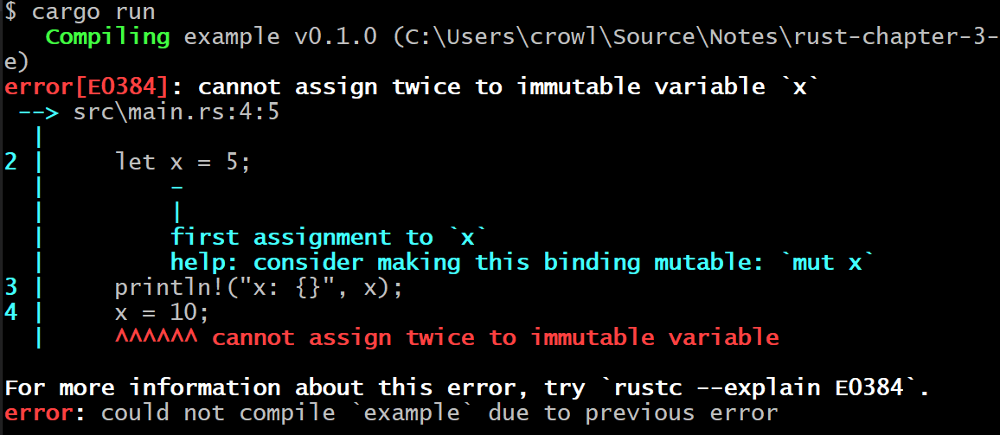
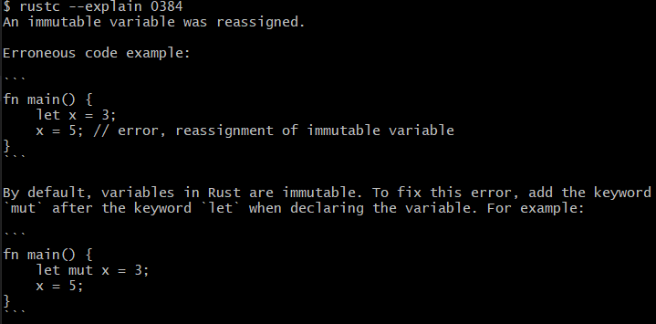

---
<!-- _class: lead invert-->


## twitter: [@rustcpp_cardiff](https://twitter.com/rustcpp_cardiff)
## email: [rustandcppcardiff@gmail.com](rustandcppcadiff@gmail.com)
## discord: [https://discorg.gg/dU93rHt6](https://discorg.gg/dU93rHt6)


---

<!-- _class: lead invert-->

# Objectives

Learn and share
Introduce new people
Challenge ourselves
Real world solutions
Advance our ability

---


---
<!-- _class: invert-->

# Conduct

- Privacy
- [Code of Conduct](https://www.rust-lang.org/policies/code-of-conduct)
  - Just be wonderful
- [Pacman rule](https://www.ericholscher.com/blog/2017/aug/2/pacman-rule-conferences/)

---

<!-- _class: lead invert-->


---


---

<!-- _class: lead-->

# **Rust Book**

Recap on last week
_Setup_

---
<!-- _class: invert -->

#### Recap

- Installed rust toolchain
  - Instructions: https://www.rust-lang.org/tools/install
  - Open "The Book" with command: `rustup doc --book`
- Chapters 1 & 2
  - "Hello, World!" and "Hello, Cargo!"
  - Programming a guessing game
- Joined the Rust and C++ Cardiff discord
  - https://discorg.gg/dU93rHt6

---

<!-- _class: invert-->

#### Recap

- Setup debugging in VSCode
  - Launch VSCode in the folder created by `cargo new`
  - Install VSCode extension `CodeLLDB`
  - Install VSCode extension `Rust Analyzer`
  - Click "run and debug" button on left hand side of VSCode
  - Click "Add config file"
  - VSCode should autodetect the cargo.toml and ask if you want to it create the file for you
  - Click yes

---

<!-- _class: lead-->

# **Rust Book**

Chapter 3
_Common Programming Concepts_

---

3\. Common Programming Concepts
- 
- 3.1. Variables and Mutability
- 3.2. Data Types
- 3.3. Functions
- 3.4. Comments
- 3.5. Control Flow


---
<!-- _class: invert-->

### Immutable by default

- Errors if you try to change data without marking it mutable
```rust
    let x = 5;
    x = 6;  // ERROR
```
- Warnings if you mark something mutable which doesn't need to be

---
<!-- _class: invert-->

### Compiler Errors

- Tell you exactly where the problem is
- E.g.

```rust
fn main() {
    let x = 5;
    println!("The value of x is: {}", x);
    x = 6;
    println!("The value of x is: {}", x);
}
```

---
<!-- _class: invert-->




---
<!-- _class: invert-->

## If that's not enough, it tells you how to get more error info with:

# `rustc --explain E0384`

---
<!-- _class: invert-->




---
<!-- _class: invert-->

# Const keyword

```rust
const THREE_HOURS_IN_SECONDS: u32 = 60 * 60 * 3;
```

- Use `const` keyword instead of `let`
- Cannot be mutable
- Compile time evaluated
- Convention is to use all caps

--- 
# Shadowing

Example highlights the care needed with scope

```rust
fn main() {
    let x = 5;

    let x = x + 1; // 6

    {
        let x = x * 2;
        println!("The value of x in the inner scope is: {}", x); // 12
    }

    println!("The value of x is: {}", x); // 6
}
```

---

# 3.2 Data Types

Type annotations where needed
```rust
    let guess: u32 = "42".parse().expect("Not a number!");
```
Alternatively, can specify the `parse` template parameter
```rust
    let guess = "42".parse::<u32>().expect("Not a number!");
```

---

<!-- _class: lead invert -->

# Scalar types

Length |	Signed	| Unsigned
:-: | :-: | :-:
8-bit	|i8	|u8
16-bit|	i16	|u16
32-bit|	i32	|u32
64-bit|	i64	|u64
128-bit|	i128|	u128
architecture	|isize	|usize

---

# Two's complement representation

- Need a sign bit to show negative values

Binary | Decimal
:-: | :-:
`00000110` | $6$
`1???????` | $-6$

- Want to representation where arithmetic still makes sense i.e $-6 + 6 = 0$

---
<!-- _class: lead -->

| | |
| --- | --- |
6 | `00000110` $6$ in i8 storage
Flipped bits | `11111001`
Add 1 so it wraps around 0 | `11111010` $-6$ in i8 storage

---
<!-- _class: invert -->

### Handling overflow

- wrapping_add
```rust
    let val: u8 = my_int.wrapping_add(to_add);
```
- checked_add
```rust
    let val: u8 = my_int.checked_add(to_add).expect("Overflowed!");
```

---
<!-- _class: invert -->

### Handling overflow

- overflowing_add
```rust
    let (val, overflowed) = my_int.overflowing_add(to_add);
```
- saturating_add
```rust
    let val: u8 = my_int.saturating_add(to_add);
```

---
<!-- _class: lead invert-->

### Handling overflow


Type | 200 + 10 | 200 + 100
:-: | :-: | :-:
\+ | 210 | Undefined
wrapping_add | 210 | 44
checked_add | Some(210) | None 
overflowing_add | (210, false) | (44, true)
saturating_add | 210 | 255

---
# Ways of writing numeric literals

Name | Example | Decimal
--- | --- | ---
Decimal	| 98_222 | $98,222$
Hex	| 0xff | $255$
Octal	| 0o77 | $63$
Binary	| 0b1111_0000 | $240$
Byte (u8 only)	| b'A' | $65$

---
<!-- _class: -->
## These will print as decimals unless specified otherwise
```rust
    println!("{}", 98_222);  // Prints 98222
    println!("{}", 0xff);    // Prints 255
    println!("{}", 0o77);    // Prints 63
    println!("{}", 0b1111_0000); // Prints 240
    println!("{}", b'A');    // Prints 65
```

- Print as hex:
```rust
    println!("{:#x}", 0xff);    // Prints 0xff
```
---
<!-- _class: invert-->

## Floats

- Rust defaults to f64 (64 bits)
- IEEE 754 representation
   - 1 sign bit
   - 11 bits for exponent
   - 52 bits for significand

   ${-1}^{sign}*(1 + significand)*2^{exponent}$

- Essenitally base 2 scientific notation

---
<!-- _class: Gaia-->

### Other types

- Boolean type is just like other languages 
  - `let f: bool = false;`
- Char type is 4 bytes (unicode scalar)
  - `    let heart_eyed_cat = '😻';`
- Arrays are similay to C++ std::array EXCEPT always does runtime bounds checking
```
let a: [i32; 5] = [1, 2, 3, 4, 5];
let val = a[index_above_5]; // PANIC
```

---
### Other types

- Tuple types are super handy
  - Can infer types or explicitly annotate it
  - Can get constituent parts (similar to structured bindings in C++)
  - Can access with `.index` syntax
```rust
    let tup = (500, 6.4, 1);
    let (x, y, z) = tup;

    let x: (i32, f64, u8) = (500, 6.4, 1);
    let five_hundred = x.0
    let six_point_four = x.1
    let one = x.2
```

---
<!-- _class: invert-->

# 3.3 Functions
- Must declare type of all params
- Declare return types with arrow
```rust
fn plus_one(x: i32) -> i32 {
    x + 1
}
```
- Note the lack of semicolon at end of `x + 1`
- Could also have written `return x + 1;` with or without semicolon, but this is less common in rust

---
<!-- _class: invert-->
### Statements, expressions, values

- Statements do not return values e.g.
  - Function definitions
  - `let` statements
- Expressions evaluate to values e.g.
  - Calling a function
  - Expressions like `x + y`
    - _Putting a semicolon at the end `x + y;` makes it a statement_

---
<!-- _class: invert-->
#### If expressions

-  Rust will not automatically try to convert non-Boolean types to a Boolean
```rust
let three = 3;
if three { // FAILS TO COMPILE
  println!("Three");
}
```
- They can be used to assign with let statement (branches must have compatible return types):
```rust
    let number = if condition { 5 } else { 6 };
```

---
# Loops

- Simple `loop` with break:
```rust
    let mut x = 1;
    loop {
        if x > 10 {
          break;
        }
        println!("{}", x);
        x = x + 1;
    }
```

---
<!-- _class: invert-->

- Named loops with named breaks:
```rust
    'row_loop: loop {
        if row >= grid.len() {
          break 'row_loop;
        }
        'column_loop: loop {
            if column >= grid[0].len(){
                break 'column_loop;
            }
            print!("{}, ", grid[row][column]);
            column += 1;
        }
        print!("\n");
        row += 1;
        column = 0;
    }
```

---
### Returning values from loops
- Return types must match on all breaks
```rust
    let mut counter = 45;
    let result = loop {
        if counter % 12 == 0 {
            break counter / 12; // Semicolon optional, similar to return
        }
        if counter % 23 == 0 {
            break counter / 23;
        }
        counter += 1
    }; // Not sure why this semicolon is also optional...

    println!("The result is {}", result); // Prints 2
```

---
### Other loops
- While loops
  - Same as other languages, breaks when condition false
- For loops
  - Use on iterators

```rust
    let a = [10, 20, 30, 40, 50];

    for element in a {
        println!("the value is: {}", element);
    }
```

---
### Other loops
- For loops with range type

```rust
    for number in 1..11 {
        println!(" {}", number); // prints numbers 1 to 10
    }
```

---
<!-- _class: invert-->

### Tester exercises!

- Convert temperatures between Fahrenheit and Celsius.
- Generate the nth Fibonacci number.
- Print the lyrics to the Christmas carol “The Twelve Days of Christmas,” taking advantage of the repetition in the song.

---

<!-- _class: lead-->

# **Rust Book**

Chapter 4
_Understanding Ownership_


---

4\. Understanding Ownership
-
- 4.1. What is Ownership?
- 4.2. References and Borrowing
- 4.3. The Slice Type

---

<!-- _class: invert-->

# Stack vs Heap
- Stack
  - Last in first out
  - Data size known at compile time
  - Data size fixed
- Heap
  - Data allocated at runtime and can change size by reallocating
  - Use pointer to memory to access data after allocation
  - More 'expensive' to create, and needs to be cleaned up

---

<!-- _class: invert-->

### String type is heap allocated so can be resized

```rust
    let mut s = String::from("hello");

    s.push_str(", world!"); // push_str() appends a literal to a String

    println!("{}", s); // This will print `hello, world!`
```
- Just like RAII (Resource Acquisition Is Initialization) in C++, the string memory is deallocated when it goes out of scope
- String is a wrapper to vec<u8>, while implements `Drop` trait, cleaning up the memory when it goes out of scope

---

### Effect on ownership

- Simple types implement the copy trait
```rust
    let x = 5;
    let y = x;
```
- Assignment here makes a **copy** of the original value
- Custom types can also implement this trait provided they don't implement the `Drop` trait

---

### Effect on ownership

- String type stores a pointer to the memory
- If you copy this string, you **move** ownership to the new string
```rust
    let s1 = String::from("hello");
    let s2 = s1;

    println!("{}, world!", s1); // ERROR
```
- This leaves the original reference invalid, so it can no longer be used

---

### Ownership 

- To copy the underlying data, you use `clone()`
```rust
    let s1 = String::from("hello");
    let s2 = s1.clone();

    println!("s1 = {}, s2 = {}", s1, s2); // Fine
```
- Potentially expensive

---
<!-- _class: invert-->

### Passing Parameters and Ownership

- Behaves just like assignment
- Will either be copy of move depending on whether type implements copy trait
```rust
fn main() {
    let x = 5;                      // x comes into scope
    makes_copy(x);                  // x would be copied into function
    println!(x)                     // So we can use x afterward

} // Here, x goes out of scope
fn makes_copy(some_integer: i32) { // some_integer comes into scope
    println!("{}", some_integer);
} // Here, some_integer goes out of scope. Nothing special happens.
```

---
<!-- _class: invert-->

### Passing Parameters and Ownership

- String implements `Drop` so is only ever moved
```rust
fn main() {
    let s = String::from("hello");  // s comes into scope
    takes_ownership(s);             // s's value moves into the function
    println!(s)                     // ERROR
} // Here, s would go out of scope, but nothing happens as already empty

fn takes_ownership(some_string: String) { // some_string comes into scope
    println!("{}", some_string);
} // Here, some_string goes out of scope and `drop` is called. The backing
  // memory is freed.
```

---

# 4.2 References and Borrowing
- References allow you to refer to some value without taking ownership of it
```rust
fn calculate_length(s: &String) -> usize { // s is a reference to a String
    s.len()
}
```
- Non-owning references like this do not call drop when they go out of scope

---
<!-- _class: invert-->

### References and Borrowing

- You can only have one mutable reference in a given scope

- A reference’s scope starts from where it is introduced and continues through the last time that reference is used 
  - _(NLL - Non-lexical lifetimes)_

- This is clearest with examples

---
<!-- _class: invert-->

```rust
    let mut s = String::from("hello");
    let r1 = &mut s;
    let r2 = &mut s; // ERROR if you try to use r1 later
    println!("{}, {}", r1, r2);
```

```rust
    let mut s = String::from("hello");

    let r1 = &mut s;
    println!("{}", r1);

    let r2 = &mut s; // Fine
    println!("{}", r2);
```
- A reference’s scope starts from where it is introduced and continues through the last time that reference is used

---

### References and Borrowing

- We also cannot have a mutable reference while we have an immutable one
- Same rules apply
```rust    let mut s = String::from("hello");

    let r1 = &s; // no problem
    let r2 = &s; // no problem
    println!("{} and {}", r1, r2);
    // Fine if variables r1 and r2 will not be used after this point

    let r3 = &mut s; // no problem
    println!("{}", r3);

    // println!("{}", r1); // If we try to use r1 or r2 again we get errors 
```

---

## These rules prevent dangling references!

```rust
fn dangle() -> &String { // dangle returns a reference to a String

    let s = String::from("hello"); // s is a new String

    &s // we return a reference to the String, s
} // Here, s goes out of scope, and is dropped. Its memory goes away.
  // Danger!
```
- Rust knows this will cause issues and can fail at compile time because of these strict borrow rules!

---

## Rules

- At any given time, you can have either one mutable reference or any number of immutable references
- References must always be valid

---

<!-- _class: invert -->

# 4.3 The Slice Type

- Slice type is a reference to a portion of a collection (e.g. String, array or vector)
  - e.g. `&[i32]`
- This section also introduces us to 
  - `.as_btyes()`
  - `.iter()`
  - `.enumerate()`
- Enumerate returns tuple of index and item_ref

---

## String slice

- The type that signifies “string slice” is written as `&str`
- String slice range indices must occur at valid UTF-8 character boundaries
  - If you attempt to create a string slice in the middle of a multibyte character, your program will exit with an error.
```rust
    let string_slice = "I am a 😻";
    let cat_slice = &string_slice[7..11]; // 😻
    let bad_slice = &string_slice[7..8]; // PANICS!
```
--- 
<!-- _class: invert -->

## Other slice types

 - `&[i32]` from array on stack
 ```rust
    let my_array = [6, 7, 8, 9, 10, 11, 12];
    let my_array_slice = &my_array[3..6];
    println!("{:?}", my_array_slice);
```
- `&[char]` from vector on heap
```rust
    let vec1 = vec!['p', 'a', 'r', 't', 'y', '🥳', '🎈'];
    let emoji_slice = &vec1[5..];
    println!("{:?}", emoji_slice);
```

---
<!-- _class: lead -->
# End of chapter 4

---
<!-- _class: gaia -->

### Gotcha I thought worth mentioning


```rust
    let arr1 = ['p', 'a', 'r', 't', 'y', '🥳', '🎈'];
    for item in arr1 {
        println!("{}", item);
    }
    println!("{:?}", arr1); // Fine
```

```rust
    let vec1 = vec!['p', 'a', 'r', 't', 'y', '🥳', '🎈'];
    for item in vec1 {
        println!("{}", item);
    }
    println!("{:?}", vec1); // ERROR
```
- Implicit use of `.into_iter()`

---
<!-- _class: gaia -->

### Can fix by adding `&`
```rust
    let vec1 = vec!['p', 'a', 'r', 't', 'y', '🥳', '🎈'];
    for item in &vec1 {
        println!("{}", item);
    }
    println!("{:?}", vec1); // ERROR
```
- The iterator returned by `into_iter` may yield any of T, &T or &mut T, depending on the context.
- The iterator returned by `iter` will yield &T, by convention.
- The iterator returned by `iter_mut` will yield &mut T, by convention.


---
<!-- _class: invert -->

# What next?

- **Chapter 5: Using Structs to Structure Related Data**
- **Chapter 6: Enums and Pattern Matching**
- _Chapter 7: Managing Growing Projects with Packages, Crates, and Modules_?